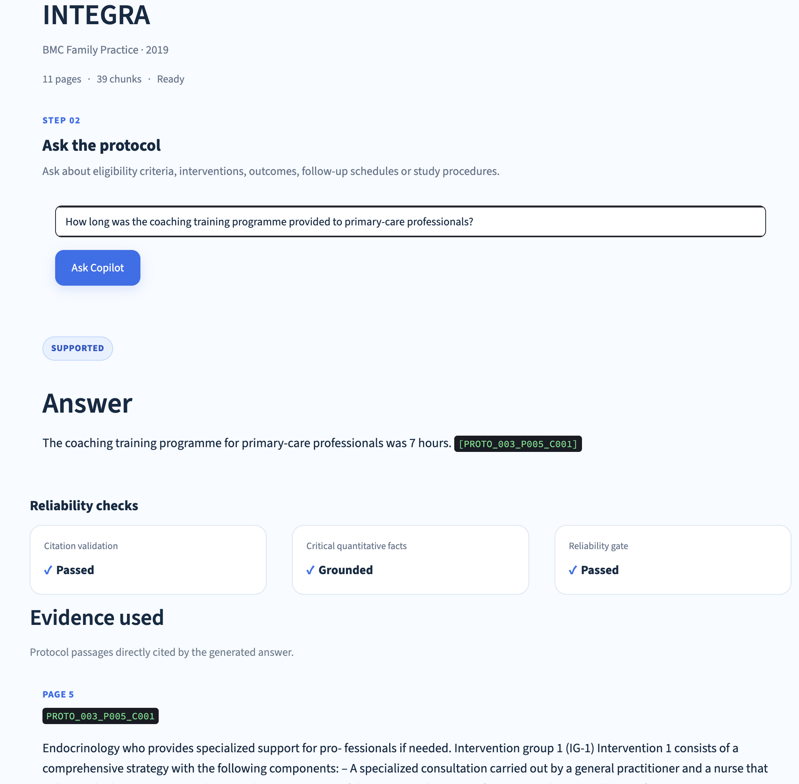
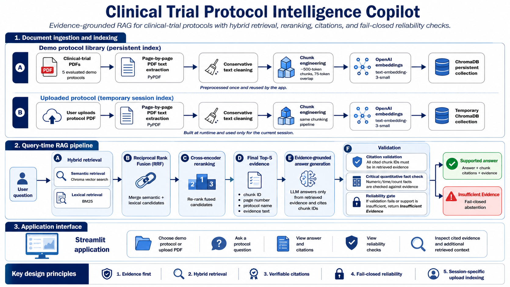
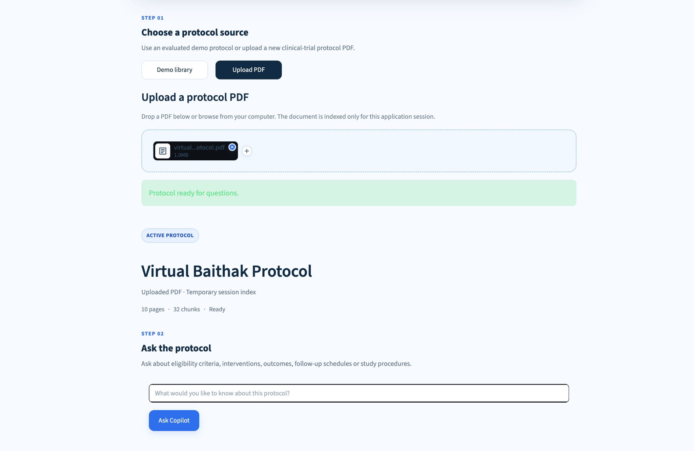
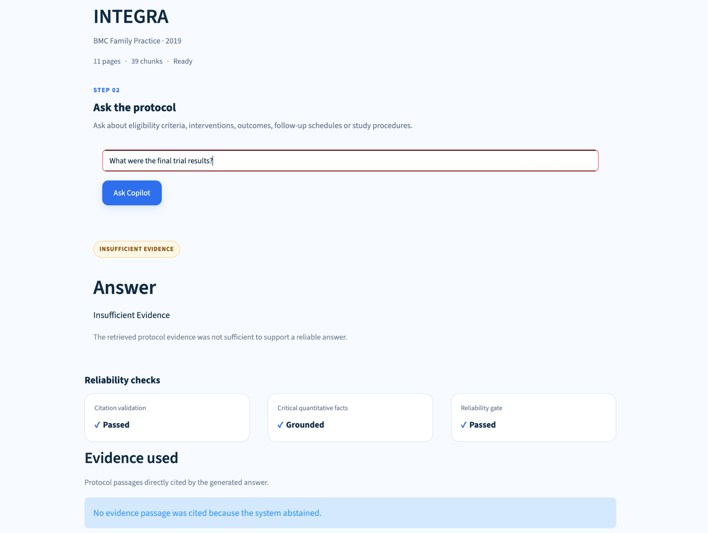

# Clinical Trial Protocol Intelligence Copilot

A reliability-focused Retrieval-Augmented Generation (RAG) system for querying clinical-trial protocols using hybrid retrieval, cross-encoder reranking, evidence-grounded generation, verifiable citations, and fail-closed abstention.



## Overview

Clinical-trial protocols are long, information-dense documents containing eligibility criteria, interventions, outcomes, study procedures, follow-up schedules, and statistical plans.

Finding a relevant passage is only part of the problem. A useful document-intelligence system also needs to rank the correct evidence highly, make answers traceable to the source, and avoid unsupported claims.

This project implements an end-to-end RAG pipeline that can:

- search an evaluated library of clinical-trial protocols
- ingest a new protocol PDF at runtime
- combine semantic retrieval with BM25 lexical search
- fuse candidate rankings using Reciprocal Rank Fusion
- rerank evidence using a cross-encoder
- generate answers constrained to retrieved evidence
- attach chunk-level citations with page traceability
- validate citations deterministically
- check selected critical quantitative facts against cited evidence
- return **Insufficient Evidence** instead of unsupported content

The application is designed for research-document exploration. It is not intended for diagnosis, treatment decisions, regulatory decisions, or clinical decision-making.

## System Architecture



The system supports two document modes.

### Demo protocols

Five evaluated protocols are preprocessed into a persistent ChromaDB collection.

### Uploaded protocols

A newly uploaded PDF is extracted, cleaned, chunked, embedded, and placed in a separate temporary session-specific Chroma index.

Uploaded documents are not added to the persistent demo index.

Both document modes use the same query-time retrieval, reranking, generation, and validation pipeline.

## How the RAG Pipeline Works

```text
User Question
      ↓
┌───────────────────────────────┐
│ Hybrid Retrieval              │
│                               │
│ Semantic Search + BM25        │
└───────────────┬───────────────┘
                ↓
      Reciprocal Rank Fusion
                ↓
       Cross-Encoder Reranker
                ↓
          Top-5 Evidence
                ↓
    Evidence-Grounded Generation
                ↓
       Citation Validation
                +
 Critical Quantitative Fact Check
                ↓
         Reliability Gate
          ↙           ↘
     SUPPORTED      INSUFFICIENT
      ANSWER          EVIDENCE
```

## Hybrid Retrieval

Semantic retrieval uses OpenAI `text-embedding-3-small` embeddings stored in ChromaDB.

Lexical retrieval uses BM25 through `rank_bm25`.

At query time the system retrieves:

```text
20 semantic candidates
20 BM25 candidates
```

The two ranked result lists are combined using **Reciprocal Rank Fusion (RRF)**.

RRF was chosen instead of directly adding semantic-similarity scores and BM25 scores because the two scoring systems are not naturally comparable.

## Cross-Encoder Reranking

The fused candidate set is reranked using:

```text
cross-encoder/ms-marco-MiniLM-L-6-v2
```

The reranker scores each candidate relative to the user question and promotes the most relevant evidence.

Only the final **Top-5 evidence passages** are provided to the generation model.

## Retrieval Evaluation

Retrieval was evaluated using a manually verified **40-question benchmark** across five clinical-trial protocols.

The benchmark contained:

```text
30 supported questions
10 unsupported questions
```

Adding a wider candidate pool and cross-encoder reranking substantially improved evidence ranking.

| Metric | Baseline Hybrid | + Cross-Encoder Reranking | Improvement |
|---|---:|---:|---:|
| Hit@1 | 60.0% | 70.0% | +10.0 pp |
| Hit@3 | 73.3% | 86.7% | +13.4 pp |
| Hit@5 | 80.0% | 93.3% | +13.3 pp |
| Hit@10 | 93.3% | 96.7% | +3.4 pp |

The benchmark was used during retrieval development, so these results are treated as a controlled benchmark and ablation study rather than a pristine untouched final test set.

## Reliability Evaluation

The 40-question evaluation also tested answer reliability.

| Check | Result |
|---|---:|
| Supported questions answered | 30 / 30 |
| Unsupported questions correctly abstained | 10 / 10 |
| Citation coverage | 30 / 30 |
| Citation validity | 30 / 30 |
| Gold evidence retrieved in Top-5 | 28 / 30 |
| Generated answer cited annotated gold evidence | 26 / 30 |

A manual grounding review found **29 of 30 supported answers fully grounded**.

One answer contained a valid citation but introduced an unsupported quantitative detail.

That failure motivated an additional production safeguard for critical quantitative facts.

This demonstrates an important distinction:

> A valid citation does not automatically prove that every claim in an answer is supported.

## Unseen Protocol Evaluation

The completed system was also evaluated on a **sixth clinical-trial protocol that was not used during retrieval or prompt development**.

The new protocol was uploaded through the Streamlit runtime ingestion workflow.

No retrieval or generation settings were changed after seeing the document.

The frozen settings included:

```text
500-token target chunks
75-token overlap
text-embedding-3-small
20 semantic candidates
20 BM25 candidates
Reciprocal Rank Fusion
cross-encoder reranking
Top-5 evidence
existing generation prompt
existing validation rules
```

Ten questions were evaluated.

| Evaluation | Result |
|---|---:|
| Overall correct | 9 / 10 |
| Answerable questions correct | 7 / 8 |
| Unsupported questions correctly abstained | 2 / 2 |
| Settings changed after upload | No |

The single failure involved a multi-fact intervention-frequency question.

The system correctly identified that IVR audio skits were delivered twice per week, but failed to include the separately stated weekly group-call frequency.

The failure is intentionally retained as a documented limitation.

## Runtime PDF Upload



A new text-based clinical-trial protocol can be uploaded directly through the application.

The runtime ingestion path is:

```text
PDF Upload
    ↓
pypdf Page Extraction
    ↓
Conservative Text Cleaning
    ↓
Page-Contained Chunking
    ↓
OpenAI Embeddings
    ↓
Temporary Chroma Index
    ↓
Hybrid Retrieval
    ↓
Reranking
    ↓
Grounded Generation
    ↓
Validation
```

Uploaded protocols use a separate temporary runtime index and are not added to the persistent demo collection.

## Grounded Answer Example


For supported questions, the application exposes:

- the generated answer
- inline chunk-ID citations
- citation-validation status
- critical quantitative-fact status
- reliability-gate status
- the cited evidence passage
- source page and chunk ID
- additional retrieved context
- retrieval and generation latency

Example citation:

```text
[PROTO_003_P005_C001]
```

This identifies:

```text
PROTO_003  → protocol
P005       → page 5
C001       → chunk 1
```

## Evidence-Aware Abstention



The generation model is explicitly constrained to the retrieved evidence.

When the protocol does not contain sufficient support, the system returns:

```text
Insufficient Evidence
```

For example, asking a trial **protocol** for final comparative trial results should not cause the model to invent results that the document does not report.

## Reliability Safeguards

### Citation Validation

Every cited chunk ID must exist in the final retrieved evidence supplied to the generation model.

If the answer cites an unknown or unavailable chunk, validation fails.

### Critical Quantitative Fact Check

The production pipeline also extracts selected quantitative facts from generated answers.

Examples include:

- percentages
- minutes
- hours
- days
- weeks
- months
- years
- participant counts
- patient counts
- subject counts
- sessions
- visits
- study arms or groups

These values are checked against the cited evidence.

This is a targeted deterministic safeguard.

It is **not** intended to provide complete semantic entailment or prove that every sentence in an answer is factually supported.

### Fail-Closed Reliability Gate

If citation validation or the critical quantitative check fails, the generated answer is not returned to the user.

Instead, the public response becomes:

```text
Insufficient Evidence
```

The raw model response can be retained internally for debugging.

## Chunk Engineering

The evaluated corpus uses page-contained recursive chunks with:

```text
Target chunk size: 500 tokens
Overlap: 75 tokens
```

Chunks do not cross PDF page boundaries.

This preserves page-level traceability while still providing enough context for protocol questions.

The original five-protocol corpus contains:

```text
52 validated pages
172 chunks
```

Stable chunk IDs allow generated answers to link directly back to retrieved evidence.

## Demo Protocol Corpus

The evaluated demo collection contains five publicly available clinical-trial protocols.

| Protocol | Journal | Year |
|---|---|---:|
| CERTAIN | BMJ Open | 2022 |
| CARE_STROKE | BMJ Open | 2018 |
| INTEGRA | BMC Family Practice | 2019 |
| LISTEN | Trials | 2023 |
| THP_TA | Trials | 2023 |

The project does not rely on private sponsor documents or protected health information.

## Technology Stack

| Component | Technology |
|---|---|
| Language | Python 3.12 |
| Application | Streamlit |
| PDF extraction | pypdf |
| Chunking | langchain-text-splitters |
| Tokenisation | tiktoken |
| Embeddings | OpenAI `text-embedding-3-small` |
| Vector store | ChromaDB |
| Lexical retrieval | BM25 / `rank_bm25` |
| Rank fusion | Reciprocal Rank Fusion |
| Reranker | `cross-encoder/ms-marco-MiniLM-L-6-v2` |
| Generation | GPT-5.6 Terra |
| Validation | Deterministic Python checks |
| Testing | pytest |

## Requirements

The project currently targets:

```text
Python 3.12
OpenAI API key
```

The application uses Python 3.12 because that is the environment against which the current project was developed and tested.

Core package dependencies are declared in:

```text
pyproject.toml
```

`requirements.txt` intentionally contains:

```text
-e .
```

This installs the local project and resolves its dependencies from `pyproject.toml`.

## Installation

Create and activate a virtual environment:

```bash
python3.12 -m venv .venv
source .venv/bin/activate
```

Install the project and development dependencies:

```bash
python -m pip install -e ".[dev]"
```

Create a `.env` file in the project root:

```text
OPENAI_API_KEY=your_key_here
```

Never commit the `.env` file.

## Run the Tests

```bash
pytest tests -v
```

Current test suite:

```text
16 passed
```

## Run the Application

```bash
streamlit run app.py
```

## Project Structure

```text
clinical-trial-protocol-intelligence-copilot/
│
├── app.py
├── README.md
├── DECISIONS.md
├── pyproject.toml
├── requirements.txt
│
├── src/
│   └── protocol_copilot/
│       ├── __init__.py
│       ├── config.py
│       ├── data.py
│       ├── generation.py
│       ├── ingestion.py
│       ├── pipeline.py
│       ├── retrieval.py
│       └── validation.py
│
├── tests/
│   ├── test_generation.py
│   ├── test_pipeline.py
│   └── test_validation.py
│
├── notebooks/
│   ├── 01_document_exploration.ipynb
│   ├── 02_chunk_engineering.ipynb
│   ├── 03_semantic_retrieval.ipynb
│   ├── 04_grounded_rag.ipynb
│   └── 05_rag_evaluation.ipynb
│
├── docs/
│   ├── architecture.png
│   ├── app_supported.png
│   ├── app_abstention.png
│   └── app_upload.png
│
└── data/
    └── metadata/
```

## Design Decisions

The main engineering decisions are documented separately in:

[DECISIONS.md](DECISIONS.md)

Topics include:

- page-contained chunking
- chunk size and overlap
- hybrid retrieval
- Reciprocal Rank Fusion
- cross-encoder reranking
- Top-5 evidence selection
- deterministic citation validation
- quantitative grounding safeguards
- fail-closed abstention
- runtime upload isolation

## Known Limitations

The system currently works best with text-based research PDFs.

Known limitations include:

- scanned or image-only PDFs may require OCR
- complex tables, figures, and diagrams may not extract cleanly
- evidence distributed across distant passages may still be missed
- valid citations do not guarantee complete claim-level grounding
- the quantitative validator checks selected structured facts rather than complete semantic entailment
- the unseen-protocol evaluation contained one incomplete multi-fact answer
- the original 40-question benchmark influenced retrieval development and is not an untouched final test set

## Intended Use

This project demonstrates retrieval, reranking, grounding, evaluation, and reliability engineering for document intelligence.

It is not intended for:

- diagnosis
- treatment recommendations
- clinical decision-making
- regulatory decisions
- replacing review by qualified clinical or research professionals

## Project Status

Completed:

- [x] PDF exploration and corpus validation
- [x] Page-contained chunk engineering
- [x] Semantic retrieval
- [x] BM25 retrieval
- [x] Reciprocal Rank Fusion
- [x] Cross-encoder reranking
- [x] Evidence-grounded generation
- [x] Citation validation
- [x] Critical quantitative-fact safeguard
- [x] Fail-closed abstention
- [x] Runtime PDF upload
- [x] Streamlit application
- [x] Automated tests
- [x] Unseen-protocol evaluation
- [x] Project packaging

Remaining:

- [ ] Public deployment
- [ ] Final repository presentation